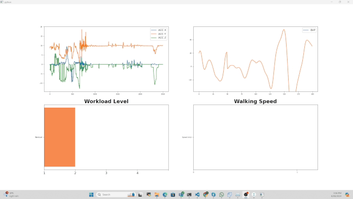

# ARIA_E4_demo
Real-time visualization app for Tobii glasses and E4 wristband
## Overview
This project develops a real-time visualization application that integrates data from Tobii glasses and the E4 wristband, providing insightful visual analytics in a user-friendly interface.

## Demo
See the application in action:

## Features
- **Real-time Data Processing**: Stream data seamlessly from both Tobii glasses and the E4 wristband.
- **Interactive Visuals**: Engage with dynamic graphs and visuals that update in real-time based on the incoming sensor data.
- **User Interface**: Designed with ease of use in mind, ensuring accessibility for all users.

## Installation
To get started with this project, clone the repository and install the necessary dependencies. For the moment we only support *Python 3.10*.
1. create a python 3.10 conda environment\
`conda create -n aria python==3.10`
2. activate the environment\
`conda activate aria`
3. install all the required packages\
`pip install requirements_all.txt`
4. clone and install [Glasses3 Python Library](https://github.com/tobiipro/g3pylib/tree/main)\
`pip install .`

## Run the demo application
`git clone https://github.com/your-username/ARIA_E4_demo.git`

`cd ARIA_E4_demo`

`python demo.main.py`
